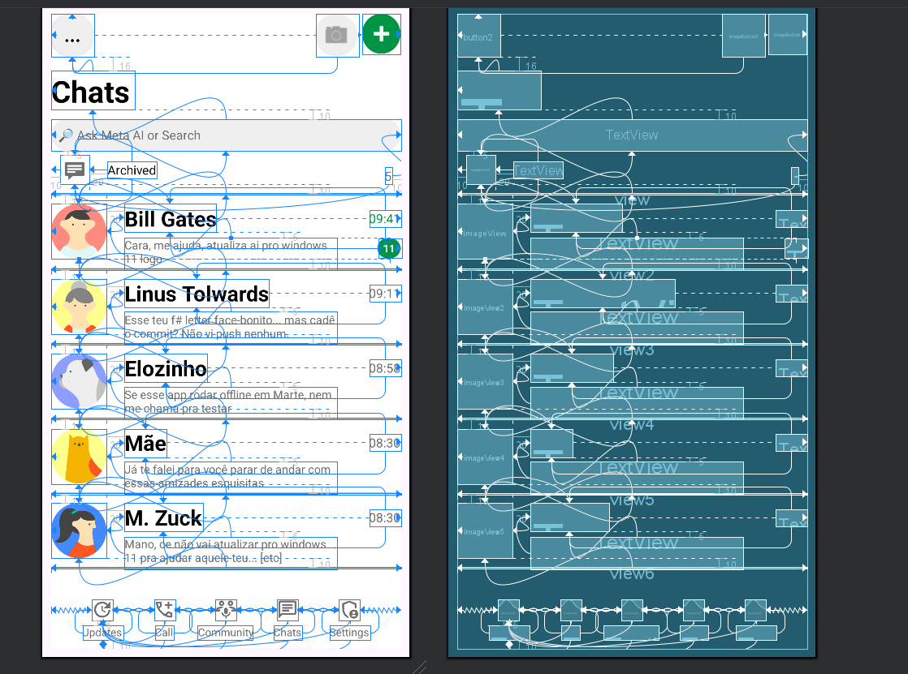
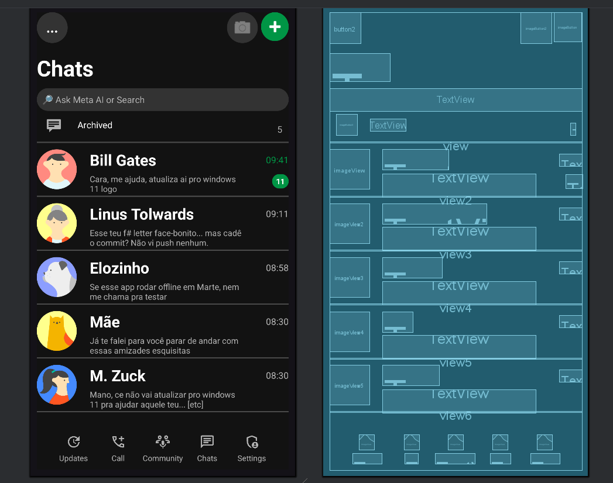

<div align="center">
<h1>
Clone da Interface do WhatsApp (Chats)
</h1>
</div>

<p align="center">


</p>

<p align="center">
Recriação da interface principal (tela de chats) do WhatsApp utilizando XML e componentes nativos do Android Studio, como parte de um estudo sobre layouts complexos.
</p>

<p align="center">
<a href="#-sobre-o-projeto">Sobre</a> •
<a href="#-tecnologias-utilizadas">Tecnologias</a> •
<a href="#-como-usar">Como Usar</a> •
<a href="#-demonstração">Demonstração</a> •
<a href="#-licença">Licença</a>
</p>

---

### 🎯 Sobre o Projeto

Este projeto é um exercício de desenvolvimento de interface de usuário (UI) para Android, focado em replicar a tela de **chats do WhatsApp**.  
O objetivo foi aprofundar os conhecimentos em **layouts complexos** e no uso exclusivo do `ConstraintLayout`, evitando totalmente layouts aninhados (sem `LinearLayout` ou `FrameLayout`).

O projeto foi desenvolvido para fins acadêmicos, seguindo os seguintes requisitos:

- Construção de toda a tela usando apenas **um `ConstraintLayout` como raiz**;  
- Suporte para **modo Light e Dark (Claro e Escuro)** através de arquivos `colors.xml` separados;  
- Uso de `ShapeableImageView` e **Drawable Resources (shapes)** para criar elementos arredondados da UI (fotos de perfil, barra de busca, botões, etc.).

---

### 🛠️ Tecnologias Utilizadas

A interface foi construída utilizando as ferramentas padrão do desenvolvimento Android nativo.

<p align="center">
<a href="#"></a>
<a href="#"></a>
<a href="#"></a>
<a href="#"></a>
</p>

---

### ⚙️ Como Usar

Para visualizar este layout:

1. Clone este repositório:
```
   git clone https://github.com/vrsmarcos26/whatsapp-clone-ui.git
```

2. Abra o projeto no **Android Studio**.  
3. Execute o aplicativo em um emulador ou dispositivo físico.  
4. Para testar o **modo Claro/Escuro**, altere o tema do dispositivo em:  
   `Configurações > Tela > Tema Escuro`.

---

### 🎬 Demonstração

<p align="center">


</p>

---

<summary><strong>💡 Análise da Estrutura do Layout (Write-up)</strong></summary>
<br>

A estrutura deste layout foi projetada para **espelhar a tela de chats do WhatsApp**, respeitando a regra de não utilizar layouts aninhados.

1. **Layout Raiz (`ConstraintLayout`)**  
   Escolhido como o contêiner principal e único, permitindo o posicionamento flexível e relativo de todos os elementos da tela.

2. **Barra Superior (Header)**  
   Contém o `AppCompatButton` (ex: “Chats”) e os `ImageButton` (ícones de câmera e adicionar).  
   Todos são alinhados ao topo do `ConstraintLayout` e entre si.  
   Seus fundos arredondados são definidos por **drawable resources (shapes)**.

3. **Título e Barra de Busca**  
   O `TextView` "Chats" e o `TextView` "Ask Meta AI..." (usado como campo de busca) são alinhados logo abaixo do cabeçalho.  
   A barra de busca tem fundo arredondado (formato “pílula”), definido por drawable que se adapta ao tema via `colors.xml`.

4. **Linha de Chats (Item da Lista)**  
   Cada contato (ex: Bill Gates, Linus, etc.) é composto por:
   - `ShapeableImageView` (foto de perfil circular);  
   - `TextView`s para nome, mensagem, hora e contador de mensagens não lidas;  
   - Um `View` genérico para o separador inferior.  
   O contador “11” é um `TextView` estilizado com drawable de pílula verde.

5. **Barra de Navegação Inferior (Bottom Bar)**  
   Criada **sem `LinearLayout`**, utilizando uma *horizontal chain* (cadeia horizontal) no `ConstraintLayout`.  
   Os 5 ícones (`ImageViews`) são distribuídos igualmente pela tela (estilo *spread*).  
   Cada `TextView` de rótulo (Updates, Calls, etc.) é posicionado exatamente abaixo do seu ícone correspondente.

---

### 📝 Licença

Este projeto está sob a licença **MIT**.

<hr>

<p align="center">
Desenvolvido por <b>Marcos Vinícius Rocha Silva</b>
</p>
